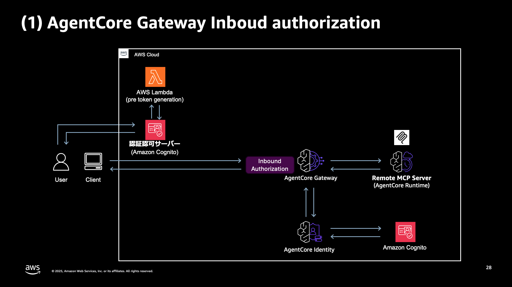
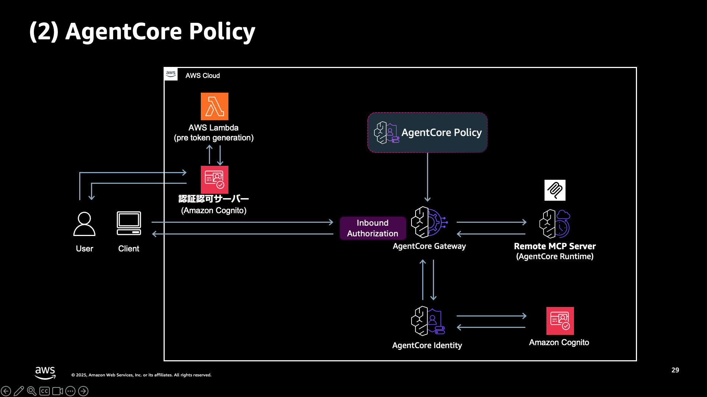
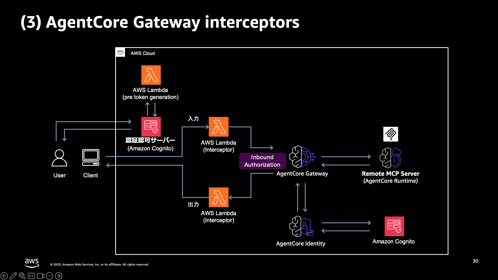

# AgentCore Gateway Access Control Demo

本リポジトリでは、Amazon Bedrock AgentCore Gateway における MCP サーバー・ツールのアクセス制御を実現する 3 つの方法の検証用 CDK コードを公開しています。

> [!NOTE]
> Zenn の記事で利用している検証コードです。是非以下もご覧下さい！
>
> [AgentCore Gateway で MCP サーバー・ツールのアクセス制御を実現する 3 つの方法 (徹底検証)](https://zenn.dev/aws_japan/articles/003-bedrock-agentcore-policy-fgac)

## 概要

AgentCore Gateway では、以下の 3 つの方法で MCP サーバー・ツールのアクセス制御を実現できます。

| 項目                           | 概要                                                                           | カスタマイズ性 | 実装容易性 |
| ------------------------------ | ------------------------------------------------------------------------------ | -------------- | ---------- |
| Inbound authorization          | JWT を基に MCP サーバーの利用可否のみ制御可能                                  | △              | ◎          |
| AgentCore Policy               | JWT とリクエスト内容を基に MCP サーバーの各ツールの利用可否を容易に制御可能    | ◯              | ◯          |
| AgentCore Gateway interceptors | JWT、リクエスト内容、外部情報を基に MCP サーバーの各ツールの利用可否を制御可能 | ◎              | △          |

本リポジトリには、各手法に対応する独立した CDK プロジェクトが格納されています。

## ディレクトリ構成

```
.
├── cdk-agentcore-gw-inbound-auth/  # Inbound Authorization (customClaims)
├── cdk-agentcore-policy/           # AgentCore Policy (Cedar)
├── cdk-agentcore-gw-interceptors/  # Gateway Interceptors (Lambda)
├── frontend/                       # テストスクリプト
│   ├── test_gateway.py             # 疎通確認スクリプト
│   └── test_gateway_latency.py     # レイテンシー計測スクリプト
└── assets/                         # アーキテクチャ図
```

## アーキテクチャ

### 1. Inbound Authorization (customClaims)

JWT のカスタムクレーム (`role`) を検証し、`admin` ロールのユーザーのみ AgentCore Gateway へのアクセスを許可します。



**主なリソース:**

- Cognito User Pool (Gateway 用・Runtime 用)
- Pre Token Generation Lambda (カスタムクレーム付与)
- AgentCore Runtime (MCP サーバー)
- AgentCore Gateway (customClaims 設定)

### 2. AgentCore Policy (Cedar)

Cedar ポリシー言語でツール単位のアクセス制御を定義します。ロールに応じて利用可能なツールを制御できます。



**主なリソース:**

- Cognito User Pool (Gateway 用・Runtime 用)
- Pre Token Generation Lambda (カスタムクレーム付与)
- AgentCore Runtime (MCP サーバー)
- AgentCore Policy Engine
- Cedar Policies (Admin Policy / User Policy)
- AgentCore Gateway

### 3. AgentCore Gateway Interceptors (Lambda)

Lambda 関数でリクエスト・レスポンスを処理し、柔軟なアクセス制御を実現します。



**主なリソース:**

- Cognito User Pool (Gateway 用・Runtime 用)
- Pre Token Generation Lambda (カスタムクレーム付与)
- Request Interceptor Lambda (認可チェック)
- Response Interceptor Lambda (ツールフィルタリング)
- AgentCore Runtime (MCP サーバー)
- AgentCore Gateway

## テストユーザー

各 CDK プロジェクトでは、以下のテストユーザーが自動作成されます。

| メールアドレス    | パスワード | ロール  | 権限                                              |
| ----------------- | ---------- | ------- | ------------------------------------------------- |
| admin@example.com | Pass123!   | `admin` | 全ツールアクセス可                                |
| user@example.com  | Pass123!   | `user`  | `retrieve_doc` のみ（Policy/Interceptors の場合） |

> [!NOTE]
> Inbound Authorization の場合、`admin` ロール以外は Gateway 自体にアクセスできません。

## MCP サーバーのツール

本デモでは、以下の Mock ツールを提供しています。

| ツール名             | 説明                   | 権限       |
| -------------------- | ---------------------- | ---------- |
| `retrieve_doc`       | 社内ドキュメントを検索 | 全ユーザー |
| `delete_data_source` | データソースを削除     | 管理者のみ |
| `sync_data_source`   | データソースを同期     | 管理者のみ |
| `get_query_log`      | クエリログを取得       | 管理者のみ |

## 前提条件

- Node.js >= 18
- Python >= 3.12
- Docker (Lambda Layer のビルドに必要)
- AWS CLI (設定済み)
- AWS CDK CLI (`npm install -g aws-cdk`)
- uv (Python パッケージマネージャー)

## デプロイ方法

各 CDK プロジェクトのデプロイ方法は共通です。

### 1. CDK プロジェクトのデプロイ

検証したい手法に対応するディレクトリに移動してデプロイします。

```bash
# Inbound Authorization の場合
cd cdk-agentcore-gw-inbound-auth

# AgentCore Policy の場合
cd cdk-agentcore-policy

# Gateway Interceptors の場合
cd cdk-agentcore-gw-interceptors
```

```bash
# 依存関係のインストール
npm ci

# CDK Bootstrap (初回のみ)
npx cdk bootstrap

# デプロイ
bash deploy.sh
```

デプロイが成功すると、以下のような出力が表示されます：

```
✅  <Stack名>

Outputs:
<Stack名>.GatewayCognitoClientId = xxxxxxxxxxxxxxxxxxxxxxxxxx
<Stack名>.AgentCoreGatewayUrl = https://xxx.gateway.bedrock-agentcore.us-east-1.amazonaws.com/mcp
<Stack名>.AgentCoreGatewayArn = arn:aws:bedrock-agentcore:us-east-1:123456789012:gateway/xxx
<Stack名>.GatewayCognitoDomain = gw-pool-xxx
<Stack名>.AgentCoreGatewayTargetName = mcp-target-xxx
```

### 2. 環境変数の設定

プロジェクトルートに `.env` ファイルを作成し、CDK デプロイの出力値を設定します。

```bash
# .env
CLIENT_ID=<GatewayCognitoClientId の値>
GATEWAY_URL=<AgentCoreGatewayUrl の値>
COGNITO_DOMAIN=<GatewayCognitoDomain の値>
MCP_TARGET_NAME=<AgentCoreGatewayTargetName の値>
REGION=us-east-1
```

## テスト方法

### 疎通確認

`test_gateway.py` を実行すると、ブラウザで Cognito ログイン画面が開きます。ログイン後、各ツールの実行結果が表示されます。

```bash
cd frontend
uv sync
uv run python test_gateway.py
```

**確認内容:**

- `tools/list` で利用可能なツール一覧を取得
- `x_amz_bedrock_agentcore_search` (AWS マネージドツール) の実行
- 各 MCP ツール (`retrieve_doc`, `get_query_log`, `sync_data_source`, `delete_data_source`) の実行

ログアウトする場合：

```bash
uv run python test_gateway.py logout
```

### レイテンシー計測

`test_gateway_latency.py` を実行すると、`tools/list` の呼び出しを 50 回実行し、平均レイテンシーと標準偏差を計測します。

```bash
cd frontend
uv run python test_gateway_latency.py
```

**出力例:**

```
=== list_tools レイテンシー計測結果 ===
試行回数:     50 回
平均実行時間: 704.02 ms
標準偏差:     26.21 ms
最小値:       650.12 ms
最大値:       780.45 ms
```

## クリーンアップ

```bash
# 該当する CDK ディレクトリで実行
npx cdk destroy
```

## ライセンス

このプロジェクトは Apache License 2.0 の下で公開されています。詳細は [LICENSE](LICENSE) ファイルを参照してください。
