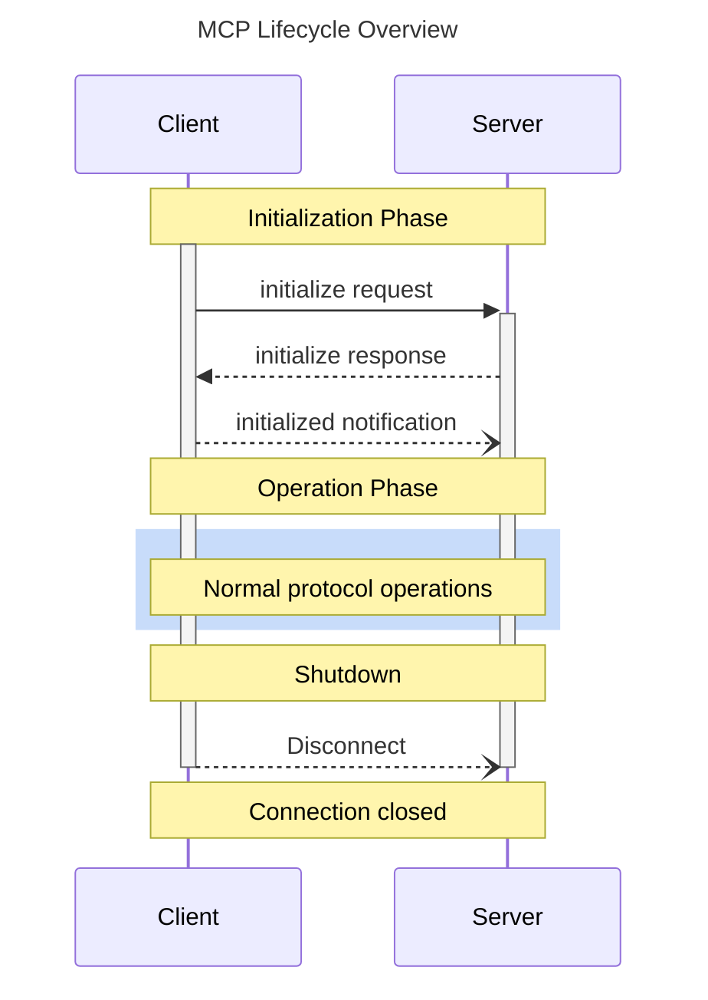

<bolg>
## はじめに

AWS Japan AI/ML Specialist Solutions Architect の [Kujirada](https://x.com/recat_125) です。
re:Invent 2025 の直前に、AgentCore Gateway interceptors が GA されました。

https://aws.amazon.com/jp/blogs/news/apply-fine-grained-access-control-with-bedrock-agentcore-gateway-interceptors/

AgentCore Gateway interceptors は、AgentCore Gateway の前段と後段に Lambda を配置し、AgentCore Gateway のリクエストとレスポンスを変換することができる機能であり、実現できることは多岐に渡ります。

本稿では、AgentCore Gateway interceptors の概要を説明し、ユーザー毎に利用可能な Agent のツールの権限制御 (Fine-grained access control) を実現する方法について、CDK の実装例とともに解説します。なお、検証に際し、以下の AWS リソースを全て CDK で実装し、Streamlit のアプリケーションから Fine-grained access control が実現可能なことを確認しました。


実装は以下のリポジトリで公開しています。

https://github.com/ren8k/aws-agentcore-gateway-interceptors-demo

## AgentCore Gateway とは

既存の API、Lambda 関数、Remote MCP サーバーを束ねて単一の MCP サーバーとして利用可能なサービス (MCP as a Service) です。大量のツールの管理、各ツールの認証認可を一元的に行え、容易に社内展開を行うことができます。


## AgentCore Gateway interceptors とは

AgentCore Gateway のリクエストとレスポンスを [AWS Lambda](https://aws.amazon.com/jp/lambda/) で制御・変換する機能です。リクエストの変換には request interceptor を、レスポンスの変換には response interceptor を利用します。なお、request interceptor と response interceptor はどちらか片方のみを利用することも可能です。


AgentCore Gateway interceptors では、Lambda の実装次第で様々なことを実現することができます。代表的な利用例として、以下のものが挙げられます。

| 利用例                                                                                                                     | 補足説明                                                                                                                                                                                                                                                                                                                      |
| -------------------------------------------------------------------------------------------------------------------------- | ----------------------------------------------------------------------------------------------------------------------------------------------------------------------------------------------------------------------------------------------------------------------------------------------------------------------------- |
| ツール利用の Fine-grained access control                                                                                   | リクエスト内のアクセストークンの scope を基に、利用ユーザー毎に、Agent が実行可能なツールの権限を制御                                                                                                                                                                                                                         |
| データ保護                                                                                                                 | [Amazon Bedrock Guardrails](https://aws.amazon.com/bedrock/guardrails/) などを利用し、MCP の実行結果に PII や機密情報が含まれる場合に除去                                                                                                                                                                                     |
| [カスタムヘッダーによる認証情報の伝播](https://docs.aws.amazon.com/bedrock-agentcore/latest/devguide/gateway-headers.html) | 最小権限の JWT やテナント情報を MCP に渡し、テナント分離を実現 ([Amazon Bedrock Knowledge Bases](https://aws.amazon.com/bedrock/knowledge-bases/) の[メタデータフィルタリング](https://aws.amazon.com/jp/blogs/news/knowledge-bases-for-amazon-bedrock-now-supports-metadata-filtering-to-improve-retrieval-accuracy/)の活用) |
| 認可のカスタマイズ                                                                                                         | 利用するツール毎に認可ロジックを Lambda 上で実装                                                                                                                                                                                                                                                                              |
| スキーマ変換                                                                                                               | MCP のツールの入出力の仕様変更発生時、 gateway inteceptors 内で変更を吸収                                                                                                                                                                                                                                                     |

request interceptor では、ツール呼び出しの実行可否の制御や、アクセストークンの権限を縮小して下流の MCP サーバーのツールに渡すことが可能です。response interceptor では、MCP サーバーの `list_tools` や AgentCore Gateway の [Semantic Search](https://docs.aws.amazon.com/bedrock-agentcore/latest/devguide/gateway-using-mcp-semantic-search.html) の実行結果 (ツールの一覧) をアクセストークンの scope を基に絞ることや、PII の検出・削除を行うことが可能です。

以降、ツール利用の Fine-grained access control (FGAC) を例に、AgentCore Gateway interceptor の仕組みについて解説します。

### request interceptor によるツールの実行可否の制御

request interceptor は、MCP クライアントと AgentCore Gateway の間に位置し、
許可されたユーザーだけが許可されたツールを実行できるようにする認可レイヤーです。具体的には、ユーザーからのツールの呼び出し (リクエスト) に対し、Lambda 上でリクエストのアクセストークン (JWT) 内の scope やテナント情報などのクレームを検証することで、実行可否を決定します。


request interceptor (Lambda) の最終的な出力は、(1) ツールの実行を許可するリクエスト (下図左の `transformedGatewayRequest`)、または (2) ツールの実行を拒否するレスポンス (下図右の `transformedGatewayResponse`) となります。

:::message
request interceptor で (1) が出力された場合、変換後のリクエストは AgentCore Gateway へ到達し、AgentCore Gateway Target に登録されたツールが実行されます。一方 (2) が出力された場合、変換後のリクエストは AgentCore Gateway へ到達しません。つまり、request interceptor のの出力が (2) の場合、AgentCore Gateway の CloudWatch Logs には記録が残りません。
:::

:::message
response interceptor を利用する場合、request interceptor の出力が (1) および (2) のどちらの場合でも (変換後のリクエストが AgentCore Gateway に到達したか否かにかかわらず) response interceptor は必ず実行される点にご留意ください。

https://docs.aws.amazon.com/bedrock-agentcore/latest/devguide/gateway-interceptors-types.html
:::


### response interceptor によるツールの情報の絞り込み

response interceptor は、AgentCore Gateway からのレスポンスに含まれるツール一覧をユーザーの権限（scope）に応じてフィルタリングします。具体的には、MCP サーバーの `list_tools` や AgentCore Gateway の Semantic Search の実行結果から、ユーザーの実行権限のないツールの情報を除去することができます。これにより、Agent やユーザーに対して不要なコンテキスト (実行不可能なツールの情報) を開示することを防ぐことができます。結果的に、不要な Tool Call が減るので Agent の振る舞いに無駄が無くなります。


response interceptor (Lambda) の最終的な出力は、以下のような、MCP クライアントに渡される形式のレスポンスとなります。

:::message
`list_tools` の実行結果だけでなく、AgentCore Gateway の Semantic Search によるツールの検索結果に対しても同様にツール情報を絞り込むことができます。
:::

:::details result of response interceptor

```json: result of response interceptor
{
  "interceptorOutputVersion": "1.0",
  "mcp": {
    "transformedGatewayResponse": {
      "statusCode": 200,
      "headers": { "Content-Type": "application/json" },
      "body": {
        "jsonrpc": "2.0",
        "id": 1,
        "result": {
          "tools": [
            {
              "inputSchema": {
                "type": "object",
                "properties": {
                  // ...
                },
              },
              "name": "<filterd_tool_name>",
              "description": "<filterd_tool_description>"
            }
            // ...
          ]
        }
      }
    }
  }
}
```

:::

## 検証

RAG 用の MCP サーバーを Agent で利用するユースケースを題材とし、AWS 上で、複数のユーザー間（通常ユーザー・管理者）で利用可能な MCP サーバーのツールを制御できることを確認しました。RAG 用の MCP サーバーは mock として実装し、利用可能なツールとして、以下の 4 種類を定義しました。

- `retrieve_doc`: 社内キュメントを検索
- `delete_data_source`: データソースを削除
- `sync_data_source`: データソースを同期
- `get_query_log`: クエリログを取得

参考に、MCP サーバーの実装を以下に示します。

:::details MCP サーバー (mock) の実装

```python:mcp_server.py
from mcp.server.fastmcp import FastMCP
from pydantic import Field

mcp = FastMCP(name="rag-operations-mcp-server", host="0.0.0.0", stateless_http=True)

SAMPLE_DOCS = [
    {"id": "doc-001", "content": "経費精算の申請方法: 1. 社内ポータルにログイン 2. 経費精算メニューを選択 3. 領収書を添付して申請"},
    {"id": "doc-002", "content": "有給休暇の申請方法: 1. 勤怠システムにログイン 2. 申請→有給休暇を選択 3. 希望日を入力し上長承認へ提出"},
    {"id": "doc-003", "content": "システム障害時の連絡網: 1次対応→情シス当番(内線9999) 2次対応→部長承認後にベンダー連絡。深夜休日は緊急連絡簿を参照。"},
]


@mcp.tool()
def retrieve_doc(
    query: str = Field(description="検索クエリ"),
    top_k: int = Field(default=5, description="取得件数"),
) -> dict:
    """一般ユーザー向けのドキュメントを検索します。"""
    _ = (query, top_k)  # ダミー実装のため未使用
    return {"documents": SAMPLE_DOCS, "total": 1}


@mcp.tool()
def delete_data_source(
    data_source_id: str = Field(description="削除するデータソースID"),
    force: bool = Field(default=False, description="ベクトルデータを削除するか"),
) -> dict:
    """データソースを削除します。"""
    return {"status": "deleted", "data_source_id": data_source_id, "force": force}


@mcp.tool()
def sync_data_source(
    data_source_id: str = Field(description="データソースID"),
    full_sync: bool = Field(default=False, description="完全同期するか"),
) -> dict:
    """データソースを同期します。"""
    return {"status": "completed", "data_source_id": data_source_id, "full_sync": full_sync}


@mcp.tool()
def get_query_log(
    start_date: str = Field(description="開始日時（ISO 8601形式）"),
    end_date: str = Field(description="終了日時（ISO 8601形式）"),
) -> dict:
    """クエリログを取得します。"""
    return {
        "logs": [{"query": "success", "timestamp": "2025-12-20T10:00:00Z"}],
        "period": {"start": start_date, "end": end_date},
    }


if __name__ == "__main__":
    mcp.run(transport="streamable-http")
```

:::

管理者ユーザーは全てのツールを利用でき、通常ユーザーは `retrieve_doc` ツールのみを利用できるように、AgentCore Gateway interceptors でツール利用の FGAC を実現しています。実際のデモを以下に示します。


## AWS アーキテクチャ

検証に際し、以下に示す AWS アーキテクチャを実装しました。本検証では、AWS CDK を利用し、白枠部分のリソースは全て一括デプロイできるようにしております。CDK の実装は以下の Github リポジトリで公開しているので、ぜひご覧下さい。

https://github.com/ren8k/aws-agentcore-gateway-interceptors-demo


アーキテクチャの全体構成について説明すると、フロントエンドでは、Streamlit アプリケーションをローカル PC 上でホストし、Agent もローカル上で実行させてます。Agent には [Strands Agents](https://strandsagents.com/latest/) を利用しています。バックエンドでは、認証認可サーバーには Cognito を、Remote MCP サーバーには AgentCore Runtime を利用しています。そして、MCP サーバーを束ねるハブとして AgentCore Gateway を使っております。

続いて、データフローを以下に示します。

- (1) Amazon Cognito のログイン画面でユーザー認証し、3LO でアクセストークンを取得
  - [Cognito の Pre token generation Lambda trigger](https://docs.aws.amazon.com/ja_jp/cognito/latest/developerguide/user-pool-lambda-pre-token-generation.html) を利用し、ユーザー毎の scope を付与
- (2) MCP サーバーのツールを利用するため、AgentCore Gateway に対しリクエストを送信
  - `list_tools` 実行時は、そのまま AgentCore Gateway にリクエストを送信
  - ツール実行時は、アクセストークンを検証してツールの実行可否を決定
- (3) request interceptor にリクエストが到着。リクエスト内のアクセストークンの scope を検証して、ツールの実行が許可されているかを確認
- (4) AgentCore Gateway Target に登録している MCP サーバーでツールを実行
  - 本検証では AgentCore Runtime で RAG 用の mock の MCP サーバーをホストしています
- (5) response interceptor に AgentCore Gateway からのレスポンスが到着
  - `list_tools` 実行時は、アクセストークンを検証して実行可能なツールの情報のみを返却
  - ツール実行時は特に何もせず MCP クライアントにレスポンスを返却。

## 実装の解説

前述のデータフローにおいて、重要な部分に焦点を当て解説します。

### Pre token generation Lambda trigger の実装

Pre token generation Lambda trigger を利用することで、Cognito が ID トークンやアクセストークンを発行する直前に Lambda を呼び出し、トークンにカスタムクレームを追加・変更することができます。例えば、認証したユーザーの所属先や実行可能なツールの scope を設定することが可能です。

実装では、ユーザーがログインした際、そのユーザーに応じた scope (権限) をアクセストークンに追加する処理を行っています。具体的には、ユーザー (mail) 毎の権限を管理するテーブルから権限を読み込み、OAuth の scope 形式に変換してアクセストークンの scope クレームに scope を追加しています。追加する scope は`event["response"]["claimsAndScopeOverrideDetails"]["accessTokenGeneration"]["scopesToAdd"]` に記述します。

:::details Lambda 実装

```python:lambda/pre_token/index.py
import json
import os

RESOURCE_SERVER_ID = os.environ.get("RESOURCE_SERVER_ID", "")
TARGET_NAME = os.environ.get("TARGET_NAME", "")

# ============================================
# 擬似DB: ユーザー毎の許可スコープ
# 本番では DynamoDB 等から取得する
# ============================================
USER_PERMISSIONS_DB = {
    "admin@example.com": {
        "role": "admin",
        "scopes": ["*"],  # 全ツールアクセス可
    },
    "user@example.com": {
        "role": "user",
        "scopes": ["retrieve_doc"],
    },
}


def get_user_scopes(email: str) -> list[str]:
    """擬似DBからユーザーの許可スコープを取得"""
    user_data = USER_PERMISSIONS_DB.get(email, {})
    raw_scopes = user_data.get("scopes", [])

    # スコープを完全な形式に変換
    full_scopes = []
    for scope in raw_scopes:
        if scope == "*":
            # 全アクセス = ターゲット名のみ
            full_scopes.append(f"{RESOURCE_SERVER_ID}/{TARGET_NAME}")
        else:
            # ツール単位 = ターゲット名:ツール名
            full_scopes.append(f"{RESOURCE_SERVER_ID}/{TARGET_NAME}:{scope}")

    return full_scopes


def lambda_handler(event, context):
    print(f"[PRE_TOKEN] Event: {json.dumps(event)}")

    trigger_source = event.get("triggerSource", "")
    email = event["request"]["userAttributes"].get("email", "")

    # 擬似DBからスコープを取得
    allowed_scopes = get_user_scopes(email)
    event["response"]["claimsAndScopeOverrideDetails"] = {
        "accessTokenGeneration": {"scopesToAdd": allowed_scopes}
    }
    print(f"[PRE_TOKEN] Response: {json.dumps(event['response'])}")

    return event
```

:::

CDK では以下のように実装しています。

:::details Cognito の CDK 実装 (一部抜粋)

```typescript:gateway-cognito.ts
// Pre Token Generation Lambda
this.preTokenLambda = new lambda.Function(this, "PreTokenGeneration", {
  runtime: lambda.Runtime.PYTHON_3_13,
  handler: "index.lambda_handler",
  code: lambda.Code.fromAsset(path.join(__dirname, "../../lambda/pre_token")),
  timeout: cdk.Duration.seconds(10),
  environment: {
    RESOURCE_SERVER_ID: `gateway-interceptor-id-${uniqueId}`,
    TARGET_NAME: targetName,
  },
});

// Cognito User Pool
this.userPool = new cognito.UserPool(this, "UserPool", {
  userPoolName: `gateway-interceptor-pool-${uniqueId}`,
  removalPolicy: cdk.RemovalPolicy.DESTROY,
  signInAliases: { email: true },
  autoVerify: { email: false },
});

// V2_0 トリガーを使用して scopesToAdd を有効化
this.userPool.addTrigger(
  cognito.UserPoolOperation.PRE_TOKEN_GENERATION_CONFIG,
  this.preTokenLambda,
  cognito.LambdaVersion.V2_0
);
```

:::

:::message
M2M 認証で Pre token generation Lambda trigger を利用する場合、trigger version を `V3_0` に設定する必要があります。また、その場合、Cognito のプランを Essentials または Plus feature tier に設定する必要があります。

https://docs.aws.amazon.com/cognito/latest/developerguide/user-pool-lambda-pre-token-generation.html
:::

### request interceptor の実装

request interceptor では、MCP クライアントからのリクエストがツール呼び出しの場合、許可された MCP サーバーのツールのみを実行するように実装しています。また、MCP クライアントからのリクエストが MCP のプロトコルメソッド (`initialize` or `tools/list`) などの場合、AgentCore Gateway にリクエストを転送するように実装しています。具体的な処理の内容を以下に示します。

1. Authorization ヘッダーからトークンを取得
2. トークンを検証して scope を取得
3. MCP のプロトコルメソッドや Semantic Search は常に実行許可
4. scope を基にツール呼び出しの認可チェック

重要な点として、[MCP のライフサイクル](https://modelcontextprotocol.io/specification/2025-11-25/basic/lifecycle)を考慮し、MCP の初期化時の MCP のプロトコルメソッド（`initialize` や `notifications/initialized`）を適切に処理するように実装する必要があります。 MCP クライアントのリクエスト送信時、最初に対峙するのは AgentCore Gateway ではなく、前段にある request interceptor (Lambda) であるためです。

具体的には、MCP クライアントと MCP サーバーの接続開始時、以下のフローでコネクションを作成します。まず、MCP クライアントは `initialize` リクエストを送信し、MCP サーバーから `initialize` レスポンスを受け取ります。その後、MCP クライアントは `notifications/initialized` リクエストを送信して初期化フェーズを完了し、Operation Phase（`tools/list` や `tools/call` などの通常のプロトコル操作）に移行します。



> _[Model Context Protocol Lifecycle](https://modelcontextprotocol.io/specification/2025-11-25/basic/lifecycle) から引用_

MCP クライアントと MCP サーバー間の初期化処理について、MCP クライアント側では、[FastMCP](https://gofastmcp.com/clients/client) や [Strands Agents](https://strandsagents.com/latest/documentation/docs/user-guide/concepts/tools/mcp-tools/) などのライブラリを利用する場合は意識する必要はありません。ライブラリ内の Python のコンテキストマネージャー (with ステートメントでの呼び出し) によって、初期化処理を自動で行えるためです。

しかし、MCP サーバー (request interceptor) 側では、MCP クライアントからのリクエストをどう捌くかという部分はユーザーの責任範囲となるため、MCP の 初期化処理の仕様に沿った実装が求められます。この対応は単純で、リクエストが MCP のプロトコルメソッドの場合、AgentCore Gateway に直接転送するだけです。

:::message
AgentCore Gateway の Semantic Search の呼び出し時について、MCP のプロトコルメソッドの場合と同様に、AgentCore Gateway に転送する必要があります。
:::

:::message
MCP クライアントから AgentCore Gateway interceptors を利用している例は [AWS Samples](https://github.com/awslabs/amazon-bedrock-agentcore-samples/tree/main/01-tutorials/02-AgentCore-gateway/09-fine-grained-access-control) にも無く、理解に苦労しました。（分かってしまえば単純ですが）
:::

:::details 実装

```python:lambda/request/index.py
import json
import os
import time
import urllib.request

from jose import jwk, jwt
from jose.utils import base64url_decode

TARGET_NAME = os.environ["TARGET_NAME"]
JWKS_URL = os.environ["JWKS_URL"]
CLIENT_ID = os.environ["CLIENT_ID"]

with urllib.request.urlopen(JWKS_URL) as f:
    keys = json.loads(f.read().decode("utf-8"))["keys"]

SYSTEM_TOOLS = {"x_amz_bedrock_agentcore_search"}

# MCP protocol methods that should always be allowed (no tool authorization needed)
# https://modelcontextprotocol.io/specification/2025-11-25/server
MCP_PROTOCOL_METHODS = {
    "initialize",  # Client initialization
    "notifications/initialized",  # Notification after successful init
    "ping",  # Keep-alive ping
    "tools/list",  # List available tools
    "resources/list",  # List resources
    "resources/read",  # Read resource
    "prompts/list",  # List prompts
    "prompts/get",  # Get prompt
    "logging/setLevel",  # Set logging level
    "completion/complete",  # Completion
}


def decode_jwt_payload(token):
    headers = jwt.get_unverified_headers(token)
    key = next((k for k in keys if k["kid"] == headers["kid"]), None)
    if not key:
        raise Exception("Public key not found")

    public_key = jwk.construct(key)
    message, encoded_signature = token.rsplit(".", 1)
    if not public_key.verify(message.encode("utf8"), base64url_decode(encoded_signature.encode("utf-8"))):
        raise Exception("Signature verification failed")

    claims = jwt.get_unverified_claims(token)
    if time.time() > claims["exp"]:
        raise Exception("Token expired")
    if claims["client_id"] != CLIENT_ID or claims.get("token_use") != "access":
        raise Exception("Invalid token")
    return claims


def check_authorization(scopes, tool_name):
    if not scopes:
        return False
    # Check if full access or specific tool permission is in scopes
    actual_scopes = [s.split("/", 1)[1] if "/" in s else s for s in scopes.split()]
    return TARGET_NAME in actual_scopes or f"{TARGET_NAME}:{tool_name}" in actual_scopes


def extract_tool_name(body):
    params = body.get("params", {})
    name = params.get("name", "")
    # Tool names are of the form: <target>___<toolName>
    return name.split("___")[-1] if "___" in name else name


def build_error_response(message, body):
    """Return an MCP-style error response"""
    return {
        "interceptorOutputVersion": "1.0",
        "mcp": {
            "transformedGatewayResponse": {
                "statusCode": 403,
                "headers": {"Content-Type": "application/json"},
                "body": {
                    "jsonrpc": "2.0",
                    "id": body.get("id"),
                    "error": {"code": -32000, "message": message},
                },
            }
        },
    }


def build_pass_through(body):
    """Build pass-through response for requests. Auth header not needed - Gateway handles outbound auth."""
    return {
        "interceptorOutputVersion": "1.0",
        "mcp": {
            "transformedGatewayRequest": {
                "headers": {"Content-Type": "application/json"},
                "body": body,
            }
        },
    }


def lambda_handler(event, context):
    print(f"[REQUEST_INTERCEPTOR] Event: {json.dumps(event)}")

    mcp = event.get("mcp", {})
    req = mcp.get("gatewayRequest", {})
    headers = req.get("headers", {})
    body = req.get("body", {})
    auth = headers.get("Authorization", "")

    print(f"[REQUEST_INTERCEPTOR] Method: {body.get('method', '')}")
    print(f"[REQUEST_INTERCEPTOR] Has auth: {bool(auth)}")

    if not auth.startswith("Bearer "):
        print("[REQUEST_INTERCEPTOR] No Bearer token")
        return build_error_response("No token", body)

    try:
        token = auth.replace("Bearer ", "")
        claims = decode_jwt_payload(token)
        scopes = claims.get("scope", "")
        method = body.get("method", "")
        tool_name = extract_tool_name(body)

        # Allow MCP protocol methods and system tools without tool-level authorization
        if method in MCP_PROTOCOL_METHODS or tool_name in SYSTEM_TOOLS:
            print(
                f"[REQUEST_INTERCEPTOR] Pass through (protocol method: {method} or system tool: {tool_name})"
            )
            return build_pass_through(body)

        authorized = check_authorization(scopes, tool_name)
        print(f"[REQUEST_INTERCEPTOR] Authorization check: {authorized}")

        if not tool_name or not authorized:
            print(f"[REQUEST_INTERCEPTOR] Denied: {tool_name}")
            return build_error_response(f"Insufficient permission: {tool_name}", body)
    except Exception as e:
        print(f"[REQUEST_INTERCEPTOR] Error: {e}")
        return build_error_response(f"Invalid token: {e}", body)

    print(f"[REQUEST_INTERCEPTOR] Allowed: {tool_name}")
    return build_pass_through(body)
```

:::

:::message
実装では、Authorization ヘッダーからトークンを取得して検証していますが、request interceptor にリクエストが到達する前に、AgentCore Gateway の Inbound 認証でも事前に検証されているようです。この点について、誤った Authorization 情報を付加して AgentCore Gateway にリクエストした場合、request interceptor に到達せずにエラーが返ることを確認しております。
:::

### response interceptor の実装

response interceptor では、AgentCore Gateway からのレスポンスにツールの一覧が含まれる場合、ユーザーの権限 (scope) に応じて開示するツールを絞り込むように実装しています。この際、ツールの一覧が含まれるケースとしては、MCP のプロトコルメソッドの `tools/list` か、AgentCore Gateway の Semantic Search の実行結果を想定しています。Response Interceptor の具体的な処理の内容を以下に示します。

1. Gateway レスポンスの body を取得
2. body にツール一覧（tools/list や Semantic Search の結果）が含まれるか確認
3. ツール一覧がなければ (`tools/call` の実行結果の場合は) そのまま返却
4. ツール一覧があれば、Authorization ヘッダーからトークンを取得・検証して scope を取得
5. scope を基にツール一覧をフィルタリングし、許可されたツールだけを返却

:::details 実装

```python:lambda/response/index.py
import json
import os
import time
import urllib.request

from jose import jwk, jwt
from jose.utils import base64url_decode

JWKS_URL = os.environ["JWKS_URL"]
CLIENT_ID = os.environ["CLIENT_ID"]

with urllib.request.urlopen(JWKS_URL) as f:
    keys = json.loads(f.read().decode("utf-8"))["keys"]


def decode_jwt_payload(token):
    headers = jwt.get_unverified_headers(token)
    key = next((k for k in keys if k["kid"] == headers["kid"]), None)
    if not key:
        raise Exception("Public key not found")

    public_key = jwk.construct(key)
    message, encoded_signature = token.rsplit(".", 1)
    if not public_key.verify(message.encode("utf8"), base64url_decode(encoded_signature.encode("utf-8"))):
        raise Exception("Signature verification failed")

    claims = jwt.get_unverified_claims(token)
    if time.time() > claims["exp"]:
        raise Exception("Token expired")
    if claims["client_id"] != CLIENT_ID or claims.get("token_use") != "access":
        raise Exception("Invalid token")
    return claims


def filter_tools(tools, scopes):
    """Filter tools based on user scopes."""
    if not scopes:
        return []
    filtered = []
    for tool in tools:
        name = tool.get("name", "")
        # Skip system-generated MCP tools without target separator
        if "___" not in name:
            continue
        target, action = name.split("___", 1)
        for scope in scopes:
            # Remove resource server prefix to get actual scope
            actual = scope.split("/")[-1] if "/" in scope else scope
            if actual == target or actual == f"{target}:{action}":
                filtered.append(tool)
                break
    return filtered


def lambda_handler(event, context):
    print(f"[RESPONSE_INTERCEPTOR] Event: {json.dumps(event)}")

    mcp = event.get("mcp", {})
    resp = mcp.get("gatewayResponse", {})
    headers = resp.get("headers", {})
    body = resp.get("body") or {}  # the body of notifications/initialized is null
    auth = headers.get("Authorization", "")

    print(f"[RESPONSE_INTERCEPTOR] Has auth: {bool(auth)}")
    print(f"[RESPONSE_INTERCEPTOR] Body keys: {list(body.keys()) if body else 'empty'}")

    result = body.get("result", {})
    tools = result.get("tools", []) or result.get("structuredContent", {}).get("tools", [])

    if not tools:
        print("[RESPONSE_INTERCEPTOR] No tools in response, skipping filter")
        filtered_body = body
    else:
        try:
            token = auth.replace("Bearer ", "") if auth.startswith("Bearer ") else ""
            claims = decode_jwt_payload(token)
            scopes = claims.get("scope", "").split()

            print(f"[RESPONSE_INTERCEPTOR] Scopes: {scopes}")
            print(f"[RESPONSE_INTERCEPTOR] Tools before filter: {[t.get('name') for t in tools]}")

            filtered = filter_tools(tools, scopes)
            print(f"[RESPONSE_INTERCEPTOR] Tools after filter: {[t.get('name') for t in filtered]}")

            filtered_body = body.copy()
            if "structuredContent" in filtered_body["result"]:
                # For semantic search results
                filtered_body["result"]["structuredContent"]["tools"] = filtered
                filtered_body["result"]["content"] = [
                    {"type": "text", "text": json.dumps({"tools": filtered})}
                ]
            else:
                # For list_tools results
                filtered_body["result"]["tools"] = filtered
        except Exception as e:
            print(f"[RESPONSE_INTERCEPTOR] Error: {e}")
            filtered_body = body

    output = {
        "interceptorOutputVersion": "1.0",
        "mcp": {
            "transformedGatewayResponse": {
                "statusCode": 200,
                "headers": {"Content-Type": "application/json"},
                "body": filtered_body,
            }
        },
    }
    print(f"[RESPONSE_INTERCEPTOR] Output: {json.dumps(output)}")
    return output
```

:::

::::message
`list_tools` と `Semantic Search` のレスポンスの形式が異なる点に注意が必要です。具体的には、`list_tool` の場合は、レスポンスの `body["result"]["tools"]` にツールの情報が格納されていますが、`Semantic Search` の場合は、レスポンスの `body["result"]["structuredContent"]["tools"]` と `body["result"]["content"]` にツールの情報が格納されています。`Semantic Search` はあくまでも通常のツール呼び出し (`tools/call`) として実行されるため、`body["result"]["content"]` にもツールの実行結果がテキスト形式で格納されます。

| メソッド・ツール  | tool の情報格納先                                                                   |
| ----------------- | ----------------------------------------------------------------------------------- |
| `list_tools`      | - `body["result"]["tools"]`                                                         |
| `Semantic Search` | - `body["result"]["structuredContent"]["tools"]` <br> - `body["result"]["content"]` |

参考に、実際のレスポンスの例を以下に示します。

:::details list_tools のレスポンス例

```json
{
  "body": {
    "jsonrpc": "2.0",
    "id": 1,
    "result": {
      "tools": [
        {
          "inputSchema": {
            "type": "object",
            "properties": {
              "query": {
                "description": "検索クエリ",
                "type": "string"
              },
              "top_k": {
                "description": "取得件数",
                "type": "integer"
              }
            },
            "required": ["query"]
          },
          "name": "<target_name>___retrieve_doc",
          "description": "一般ユーザー向けのドキュメントを検索します。"
        }
        // ...
      ]
    }
  },
  "statusCode": 200
}
```

:::

:::details Semantic Search のレスポンス例

```json
{
  "body": {
    "jsonrpc": "2.0",
    "id": 1,
    "result": {
      "structuredContent": {
        "tools": [
          {
            "inputSchema": {
              "type": "object",
              "properties": {
                "query": {
                  "description": "検索クエリ",
                  "type": "string"
                },
                "top_k": {
                  "description": "取得件数",
                  "type": "integer"
                }
              },
              "required": ["query"]
            },
            "name": "<target_name>___retrieve_doc",
            "description": "一般ユーザー向けのドキュメントを検索します。"
          }
          // ...
        ]
      },
      "isError": false,
      "content": [
        {
          "type": "text",
          "text": "{\"tools\":[{\"inputSchema\":{\"type\":\"object\",\"properties\":{\"query\":{\"description\":\"検索クエリ\",\"type\":\"string\"},\"top_k\":{\"description\":\"取得件数\",\"type\":\"integer\"}},\"required\":[\"query\"]},\"name\":\"mcp-target-interceptorlambdastack17___retrieve_doc\",\"description\":\"一般ユーザー向けのドキュメントを検索します。\"}, ... ,]}"
        }
      ]
    }
  },
  "statusCode": 200
}
```

:::

::::

CDK では以下のように実装しています。AgentCore Gateway Interceptors は、`InterceptorConfigurations` オプションにて、AgentCore Gateway 作成時に既存の Lambda 関数の ARN を Interceptor として指定することで利用できます。この際、`passRequestHeaders` オプションにて、リクエストヘッダーを Interceptors に渡すかどうか (カスタムヘッダーによる伝播) も指定することができます。

執筆時点において、AgentCore Gateway の L1 /L2 Construct では、`InterceptorConfigurations` を指定できないため、`addPropertyOverride` を利用して CloudFormation テンプレートに直接プロパティを追加しています。

:::details AgentCore Gateway Interceptors の CDK 実装 (一部抜粋)

```typescript:agentcore-gateway.ts
// Gateway の設定
const gatewayName = `gateway-interceptor-${uniqueId}`;

// AgentCore Gateway (L1 Construct)
const agentCoreGateway = new bedrockagentcore.CfnGateway(this, "Gateway", {
  name: gatewayName,
  roleArn: this.gatewayRole.roleArn,
  protocolType: "MCP",
  protocolConfiguration: {
    mcp: {
      supportedVersions: ["2025-03-26"],
      searchType: "SEMANTIC",
    },
  },
  authorizerType: "CUSTOM_JWT",
  authorizerConfiguration: {
    customJwtAuthorizer: {
      discoveryUrl: gatewayDiscoveryUrl,
      allowedClients: [gatewayClientId],
    },
  },
  exceptionLevel: "DEBUG",
});

// InterceptorConfigurations は現在の aws-cdk-lib の型定義に含まれていないため
// addPropertyOverride を使用して追加
agentCoreGateway.addPropertyOverride("InterceptorConfigurations", [
  {
    Interceptor: {
      Lambda: {
        Arn: requestInterceptor.functionArn,
      },
    },
    InterceptionPoints: ["REQUEST"],
    InputConfiguration: {
      PassRequestHeaders: true,
    },
  },
  {
    Interceptor: {
      Lambda: {
        Arn: responseInterceptor.functionArn,
      },
    },
    InterceptionPoints: ["RESPONSE"],
    InputConfiguration: {
      PassRequestHeaders: false,
    },
  },
]);
```

:::

## 検証結果

Streamlit で実装したアプリケーションで、管理者ユーザー・一般ユーザー間でツール利用の FGAC (利用可能な MCP サーバーのツールを制御) が実現できることを確認しました。Streamlit の実装を以下に示します。簡単のため、アプリケーション起動時に Cognito の認証画面に遷移するようにし、ユーザー認証後にアプリケーションを利用できるように実装しています。

:::details Streamlit 実装

```python
import asyncio
import base64
import json
import logging
import os
import urllib.parse

import requests
import streamlit as st
from dotenv import load_dotenv
from mcp.client.streamable_http import streamablehttp_client
from strands import Agent
from strands.models import BedrockModel
from strands.tools.mcp import MCPClient

logger = logging.getLogger(__name__)

# =============================================================================
# Configuration (load from .env)
# =============================================================================
load_dotenv(override=True)

CLIENT_ID = os.getenv("CLIENT_ID")
GATEWAY_URL = os.getenv("GATEWAY_URL")
COGNITO_DOMAIN = os.getenv("COGNITO_DOMAIN")
REGION = os.getenv("REGION", "us-east-1")
MODEL_ID = os.getenv("MODEL_ID", "openai.gpt-oss-20b-1:0")
SYSTEM_PROMPT = os.getenv("SYSTEM_PROMPT", "")

# Must match Cognito App Client URLs (configured in CDK)
REDIRECT_URI = os.getenv("REDIRECT_URI", "http://localhost:8080/callback")
LOGOUT_REDIRECT_URI = os.getenv("LOGOUT_REDIRECT_URI", "http://localhost:8080/logout")
AUTH_URL = f"https://{COGNITO_DOMAIN}.auth.{REGION}.amazoncognito.com/oauth2/authorize"
TOKEN_URL = f"https://{COGNITO_DOMAIN}.auth.{REGION}.amazoncognito.com/oauth2/token"
LOGOUT_URL = f"https://{COGNITO_DOMAIN}.auth.{REGION}.amazoncognito.com/logout"


# =============================================================================
# OAuth Functions
# =============================================================================
def get_auth_url() -> str:
    """Build Cognito authorization URL"""
    params = {
        "response_type": "code",
        "client_id": CLIENT_ID,
        "redirect_uri": REDIRECT_URI,
        "scope": "openid email",
    }
    return f"{AUTH_URL}?{urllib.parse.urlencode(params)}"


def get_logout_url() -> str:
    """Build Cognito logout URL"""
    params = {
        "client_id": CLIENT_ID,
        "logout_uri": LOGOUT_REDIRECT_URI,
    }
    return f"{LOGOUT_URL}?{urllib.parse.urlencode(params)}"


def exchange_code_for_token(code: str) -> dict:
    """Exchange authorization code for tokens"""
    response = requests.post(
        TOKEN_URL,
        headers={"Content-Type": "application/x-www-form-urlencoded"},
        data={
            "grant_type": "authorization_code",
            "client_id": CLIENT_ID,
            "code": code,
            "redirect_uri": REDIRECT_URI,
        },
    )
    response.raise_for_status()
    return response.json()


def decode_token(token: str) -> dict:
    """Decode JWT token payload (without verification)"""
    payload = token.split(".")[1]
    payload += "=" * (4 - len(payload) % 4)
    return json.loads(base64.b64decode(payload))


# =============================================================================
# Utility Functions
# =============================================================================
def redirect_to(url: str):
    """Redirect browser to URL and stop execution"""
    st.markdown(
        f'<meta http-equiv="refresh" content="0;url={url}">',
        unsafe_allow_html=True,
    )
    st.stop()


def create_mcp_client(access_token: str) -> MCPClient:
    """Create MCP client with Bearer token authentication"""
    headers = {"Authorization": f"Bearer {access_token}"}
    return MCPClient(lambda: streamablehttp_client(GATEWAY_URL, headers=headers, timeout=300))


def extract_response_text(result) -> str:
    """Extract text content from Agent result"""
    if hasattr(result, "message") and result.message:
        content = result.message.get("content", [])
        response_text = ""
        for block in content:
            if isinstance(block, dict) and block.get("text"):
                response_text += block["text"]
        if response_text:
            return response_text
    return str(result)


def extract_tool_info(chunk) -> tuple:
    """Extract tool information from streaming chunk"""
    event = chunk.get("event", {})
    if "contentBlockStart" in event:
        tool_use = event["contentBlockStart"].get("start", {}).get("toolUse", {})
        return tool_use.get("toolUseId"), tool_use.get("name")
    return None, None


def extract_text(chunk) -> str:
    """Extract text from streaming chunk"""
    if text := chunk.get("data"):
        return text
    elif delta := chunk.get("delta", {}).get("text"):
        return delta
    return ""


async def stream_response(agent: Agent, question: str, container) -> str:
    """Stream agent response with tool execution display"""
    text_holder = container.empty()
    buffer = ""

    async for chunk in agent.stream_async(question):
        if isinstance(chunk, dict):
            # Detect and display tool execution
            tool_id, tool_name = extract_tool_info(chunk)
            if tool_id and tool_name:
                if buffer:
                    text_holder.markdown(buffer)
                    buffer = ""
                # Format tool name for display
                display_name = tool_name.split("___")[-1] if "___" in tool_name else tool_name
                tool_text = f"🔧 **{display_name}** ツールを実行中..."
                container.info(tool_text)
                text_holder = container.empty()

            # Extract and display text
            if text := extract_text(chunk):
                buffer += text
                text_holder.markdown(buffer + "▌")

    # Final display
    if buffer:
        text_holder.markdown(buffer)

    return buffer


# =============================================================================
# Session State Management
# =============================================================================
def init_session_state():
    """Initialize session state if not exists"""
    if "access_token" not in st.session_state:
        reset_session_state()


def reset_session_state():
    """Reset all session state to initial values"""
    st.session_state.access_token = None
    st.session_state.user_info = None
    st.session_state.tools = []
    st.session_state.mcp_client = None
    st.session_state.agent = None


def close_mcp_client():
    """Close MCP client if exists"""
    if st.session_state.mcp_client:
        try:
            st.session_state.mcp_client.__exit__(None, None, None)
        except Exception:
            logger.debug("MCP client close failed", exc_info=True)


# =============================================================================
# OAuth Callback Handler
# =============================================================================
def handle_oauth_callback():
    """Handle OAuth callback and setup session"""
    if "code" not in st.query_params:
        return
    if st.session_state.access_token is not None:
        return

    try:
        code: str = st.query_params["code"]
        tokens = exchange_code_for_token(code)

        # Store access token
        st.session_state.access_token = tokens["access_token"]

        # Extract user info from tokens
        id_claims = decode_token(tokens["id_token"])
        access_claims = decode_token(tokens["access_token"])
        st.session_state.user_info = {
            "email": id_claims.get("email"),
            "scope": access_claims.get("scope"),
        }

        # Clear query params and rerun
        st.query_params.clear()
        st.rerun()

    except Exception as e:
        st.error(f"Login failed: {e}")


def initialize_mcp():
    """Ensure MCP client and tools are initialized"""
    if st.session_state.mcp_client is None:
        st.session_state.mcp_client = create_mcp_client(st.session_state.access_token)
        st.session_state.mcp_client.__enter__()
        st.session_state.tools = st.session_state.mcp_client.list_tools_sync()


def initialize_agent():
    """Ensure agent is initialized (requires tools to be initialized first)"""
    if st.session_state.agent is None:
        model = BedrockModel(model_id=MODEL_ID)
        st.session_state.agent = Agent(
            model=model,
            system_prompt=SYSTEM_PROMPT,
            tools=st.session_state.tools,
            callback_handler=None,
        )


# =============================================================================
# UI Components
# =============================================================================
def render_sidebar():
    """Render sidebar with user info, tools, and logout button"""
    with st.sidebar:
        render_user_info()
        render_tools_list()
        render_logout_button()


def render_user_info():
    """Render user info section in sidebar"""
    st.markdown("### 👤 User Info")
    user_info = st.session_state.user_info or {}
    st.markdown(f"**Email:** {user_info.get('email', 'N/A')}")


def render_tools_list():
    """Render available tools list in sidebar"""
    st.markdown("### 🔧 Available Tools")
    if st.session_state.tools:
        for tool in st.session_state.tools:
            name = tool.tool_name
            display_name = name.split("___")[-1] if "___" in name else name
            st.markdown(f"- `{display_name}`")
    else:
        st.warning("No tools available")


def render_logout_button():
    """Render logout button in sidebar"""
    st.divider()
    if st.button("🚪 Logout"):
        close_mcp_client()
        reset_session_state()
        redirect_to(get_logout_url())


def render_chat_history(messages):
    """Render chat message history"""
    st.markdown("### 💬 Chat with Agent")
    for message in messages:
        last_block = message["content"][-1]
        if "toolUse" in last_block:
            tool_name = last_block["toolUse"]["name"].split("___")[-1]
            st.info(f"🔧 **{tool_name}** ツールを実行中...")
        elif "text" in last_block:
            with st.chat_message(message["role"]):
                st.markdown(last_block["text"])


def handle_chat_input():
    """Handle chat input and agent response with streaming"""
    if prompt := st.chat_input("メッセージを入力..."):
        with st.chat_message("user"):
            st.markdown(prompt)

        # Get and display agent response with streaming
        with st.chat_message("assistant"):
            try:
                container = st.container()
                # Run async streaming
                loop = asyncio.new_event_loop()
                loop.run_until_complete(stream_response(st.session_state.agent, prompt, container))
                loop.close()
            except Exception as e:
                error_msg = f"Error: {e}"
                st.error(error_msg)


# =============================================================================
# Main App
# =============================================================================
def app():
    """Main application UI"""
    st.set_page_config(page_title="FGAC Demo", page_icon="🔐", layout="wide")
    st.title("🔐 FGAC Demo: Tool Access Control")

    # Initialize MCP client, tools, and agent (must be before render_sidebar)
    initialize_mcp()
    initialize_agent()

    # Render components
    render_sidebar()
    render_chat_history(st.session_state.agent.messages)
    handle_chat_input()


def main():
    """Entry point - handles routing based on auth state"""
    init_session_state()
    handle_oauth_callback()

    if st.session_state.access_token is None:
        redirect_to(get_auth_url())
    else:
        app()


if __name__ == "__main__":
    main()
```

:::

管理者ユーザーでログインすると、アプリケーションの左側で、ログインユーザー情報と利用可能なツールの情報を表示してます。以下の画像では、管理者ユーザーでログイン後、Knowledge Bases の データソースを削除する mock のツールである `delete_data_source` を実行している様子を示しています。


一般ユーザーでログインすると、アプリケーションの左側で、利用可能なツールが一つ (`retrieve_doc`) しかないことを確認できます。以下の画像では、一般ユーザーでログイン後、利用可能なツールは実行できないこと、および、利用可能なツールのみ実行できることを示しています。


## おわりに

本稿では、AgentCore Gateway interceptors の概要や利用例について紹介し、ツール利用の Fine-grained access control (FGAC) の実現方法について、実装レベルまで詳細に解説しました。また、Steramlit を利用したデモを通し、ログインユーザー毎に利用可能な MCP サーバーのツールを制御できることも確認しました。

社内で MCP サーバーを運用する上で、利用者毎に利用可能なツールを制御することは、今後重要な要素になると予想されます。類似のサービスで、[AgentCore Policy](https://docs.aws.amazon.com/bedrock-agentcore/latest/devguide/policy.html) でも同様のことを実現できますが、AgentCore Gateway interceptors では Lambda を利用しているので、外部 DB からユーザー毎の権限情報を動的に取得し、独自の認可ロジックを実装するなど、自由度高く設計することが可能です。(AgentCore Gateway interceptors と AgentCore Policy の使い分けについても執筆予定です。)

最後に、MCP 運用時に FGAC を実現する上で、本稿が参考になれば幸いです。

## Appendix

### MCP サーバー更新時の対応について

AgentCore Gateway の Target に登録した MCP サーバーの実装（ツールの引数や説明など）を変更した場合、AgentCore Gateway が保持しているツール定義のキャッシュも更新する必要があります。これは、`SynchronizeGatewayTargets API` を実行することで更新できます。

CDK での実装では、`SynchronizeGatewayTargets` に対応する CloudFormation リソースが存在しないため、CDK CustomResource を使用しています。また、MCP サーバーのソースコードが変更された場合にのみ同期処理が実行されるよう、ソースコードのハッシュ値を `physicalResourceId` に含めています。これにより、MCP サーバーの実装に変更がない場合は同期処理がスキップされ、不要な API 呼び出しを防ぐことができます。

:::details CDK 実装 (一部抜粋)

```typescript:lib/constructs/agentcore-gateway.ts
const syncGatewayTargets = new cr.AwsCustomResource(
      this,
      "SyncGatewayTargets",
      {
        installLatestAwsSdk: true,
        onCreate: {
          service: "bedrock-agentcore-control",
          action: "SynchronizeGatewayTargets",
          parameters: {
            gatewayIdentifier: agentCoreGateway.attrGatewayIdentifier,
            targetIdList: [gatewayTarget.attrTargetId],
          },
          physicalResourceId: cr.PhysicalResourceId.of(
            `SyncGatewayTargets-${uniqueId}-${mcpServerHash}`
          ),
        },
        onUpdate: {
          service: "bedrock-agentcore-control",
          action: "SynchronizeGatewayTargets",
          parameters: {
            gatewayIdentifier: agentCoreGateway.attrGatewayIdentifier,
            targetIdList: [gatewayTarget.attrTargetId],
          },
          physicalResourceId: cr.PhysicalResourceId.of(
            `SyncGatewayTargets-${uniqueId}-${mcpServerHash}`
          ),
        },
        policy: cr.AwsCustomResourcePolicy.fromStatements([
          new iam.PolicyStatement({
            actions: ["bedrock-agentcore:*"],
            resources: ["*"],
          }),
        ]),
        logRetention: logs.RetentionDays.ONE_WEEK,
        timeout: cdk.Duration.minutes(5),
      }
    );

    // SyncGatewayTargets は GatewayTarget の作成完了を待つ必要がある
    syncGatewayTargets.node.addDependency(gatewayTarget);
```

:::
</blog>
<notebook>
{
"cells": [
{
"cell*type": "markdown",
"metadata": {},
"source": [
"# Amazon Bedrock AgentCore Policy - Getting Started Demo\n",
"\n",
"## Overview\n",
"\n",
"Welcome to the Amazon Bedrock AgentCore Policy hands-on demo! This notebook will guide you through the complete workflow of setting up and testing policy-based deterministic controls for AI agent-tool interactions.\n",
"\n",
"### What is AgentCore Policy?\n",
"\n",
"Amazon Bedrock AgentCore Policy enables developers to define and enforce security controls for AI agent interactions with tools by creating a protective boundary (\"safety box\") around agent operations. AI agents can dynamically adapt to solve complex problems, but this flexibility introduces security challenges:\n",
"\n",
"- **Data Leakage**: Agents may inadvertently expose private information\n",
"- **Business Rule Violations**: Agents might misinterpret or bypass business rules\n",
"- **Authority Overreach**: Agents could act outside their intended scope\n",
"\n",
"Policy intercepts inbound agent traffic through AgentCore Gateways and evaluates each request against defined policies before allowing tool access.\n",
"\n",
"### Key Benefits\n",
"\n",
"✅ **Declarative Security**: Define policies using Cedar language, not code \n",
"✅ **Runtime Enforcement**: Policies are evaluated in real-time \n",
"✅ **Fine-Grained Control**: From coarse restrictions to detailed access control/ authroization\n",
"✅ **Separation of Concerns**: Security logic lives outside agent code \n",
"✅ **Enterprise Scale**: Deploy autonomous agents safely in production \n",
"\n",
"---\n",
"\n",
"## Demo Architecture\n",
"\n",
"```\n",
"┌─────────────┐\n",
"│ AI Agent │\n",
"└──────┬──────┘\n",
" │\n",
" │ Tool Call Request\n",
" ▼\n",
"┌─────────────────────┐\n",
"│ AgentCore Gateway │\n",
"│ + OAuth Auth │\n",
"└──────┬──────────────┘\n",
" │\n",
" │ Policy Check\n",
" ▼\n",
"┌─────────────────────┐\n",
"│ Policy Engine │\n",
"│ (Cedar Policies) │\n",
"└──────┬──────────────┘\n",
" │\n",
" │ ALLOW / DENY\n",
" ▼\n",
"┌─────────────────────--┐\n",
"│ Gateway Targets │\n",
"│ │ \n",
"└─────────────────────--┘\n",
"```\n",
"\n",
"---\n",
"\n",
"## What You'll Learn\n",
"\n",
"In this demo, you will set up a agent with tools to help perform insurance underwriting:\n",
"\n",
"1. **Setup Infrastructure**: Create a Gateway with Lambda targets for creating insurance application, invoking a risk model and approving insurance claims\n",
"2. **Create Policy Engine**: Initialize a policy engine for your gateway\n",
"3. **Define Policies**: Write Cedar policies to control access\n",
"4. **Test Enforcement**: Verify policies work with real agent requests\n",
"5. **Understand Results**: Interpret ALLOW and DENY scenarios\n",
"\n",
"---\n",
"\n",
"## Prerequisites\n",
"\n",
"Before starting, ensure you have:\n",
"\n",
"- ✅ AWS CLI configured with appropriate credentials\n",
"- ✅ Python 3.10+ with boto3 installed\n",
"- ✅ `bedrock_agentcore_starter_toolkit` package installed\n",
"- ✅ Access to AWS Lambda (for target functions)\n",
"\n",
"---\n",
"\n",
"## Demo Scenario: Insurance Underwriting Processing\n",
"\n",
"We'll implement a **insurance underwriting processing system** with policy controls:\n",
"\n",
"- **Tools**: \n",
" - `ApplicationTool` - Creates a insurance application for a region and coverage_amount\n",
" - `RiskModelTool` - Invokes external risk scoring model with governance controls, when provided API classification and data governance approval\n",
" - `ApprovalTool` - Approve high-value or high-risk underwriting decisions, parameters claim_amount and risk_level\n",
"\n",
"\n",
"Let's get started! 🚀"
]
},
{
"cell_type": "markdown",
"metadata": {},
"source": [
"---\n",
"\n",
"# Step 0: Environment Setup\n",
"\n",
"First, let's verify our environment and import necessary libraries."
]
},
{
"cell_type": "code",
"execution_count": null,
"metadata": {},
"outputs": [],
"source": [
"# Install requirements\n",
"%pip install -r requirements.txt"
]
},
{
"cell_type": "code",
"execution_count": null,
"metadata": {},
"outputs": [],
"source": [
"# Import required libraries\n",
"import sys\n",
"from pathlib import Path\n",
"import boto3\n",
"import json\n",
"import logging"
]
},
{
"cell_type": "code",
"execution_count": null,
"metadata": {},
"outputs": [],
"source": [
"# Add the scripts directory to Python path\n",
"scripts_dir = Path.cwd() / \"scripts\"\n",
"if str(scripts_dir) not in sys.path:\n",
" sys.path.insert(0, str(scripts_dir))\n",
"\n",
"# Verify region\n",
"session = boto3.Session()\n",
"region = session.region_name or \"us-east-1\"\n",
"\n",
"# Verify AWS credentials\n",
"try:\n",
" sts = session.client(\"sts\")\n",
" identity = sts.get_caller_identity()\n",
" print(\"✅ AWS Credentials Verified\")\n",
" print(f\" Account: {identity['Account']}\")\n",
" print(f\" User/Role: {identity['Arn']}\")\n",
"except Exception as e:\n",
" print(f\"❌ AWS Credentials Error: {e}\")\n",
" print(\" Please configure AWS CLI with: aws configure\")"
]
},
{
"cell_type": "markdown",
"metadata": {},
"source": [
"---\n",
"\n",
"# Step 1: Create Target Functions for AgentCore Gateway\n",
"\n",
"Before setting up the gateway, we need functions that will serve as our tool targets for the Agent.\n",
"\n",
"## What is a Lambda Target?\n",
"\n",
"A Lambda target is a backend function that the AI agent can invoke through the gateway. In our case, we are setting up 3 lambda functions, for ApplicationTool, RiskModelTool and ApprovalTool to support the agent perform insurance underwriting tasks. \n",
"\n",
"### Create via CLI (run the cell below)\n",
"Running the following script will deploy 3 Lambdas in your AWS account:\n",
"\n",
"1. Application Tool: Simplified Application Creation (Mocked Up for Demo purpose)\n",
" Creates insurance applications with applicant region and coverage amount\n",
" Parameters:\n",
" - applicant_region: Customer's geographic region\n",
" - coverage_amount: Requested insurance coverage amount\n",
"\n",
"2. Risk Model Tool: Simplified Risk Model Access (Mocked Up for Demo purpose)\n",
" Invokes risk scoring model and returns assessment\n",
" Parameters:\n",
" - API_classification: API classification (public, internal, restricted)\n",
" - data_governance_approval: Whether data governance has approved model usage\n",
"\n",
"3. Approval Tool: - Insurance Approval Process (Mocked Up for Demo purpose)\n",
" Approves underwriting decisions and claim amounts\n",
" Parameters:\n",
" - claim_amount: Insurance claim/coverage amount\n",
" - risk_level: Risk level assessment (low, medium, high, critical)"
]
},
{
"cell_type": "code",
"execution_count": null,
"metadata": {},
"outputs": [],
"source": [
"%run scripts/lambda-target-setup/deploy_lambdas.py "
]
},
{
"cell_type": "markdown",
"metadata": {},
"source": [
"---\n",
"\n",
"# Step 2: Setup AgentCore Gateway\n",
"\n",
"Now we'll create an AgentCore Gateway with OAuth authentication and attach our Lambda functions as targets.\n",
"\n",
"## What Gets Created?\n",
"\n",
"1. **OAuth Authorization Server**: Cognito-based OAuth for authentication\n",
"2. **AgentCore Gateway**: Main gateway with MCP protocol support\n",
"3. **Lambda Target**: Your Lambda functions attached with schema definition\n",
"4. **Configuration File**: All connection details saved for later use\n",
"\n",
"## Gateway Configuration\n",
"\n",
"The gateway will be configured with:\n",
"- **Protocol**: MCP (Model Context Protocol)\n",
"- **Authentication**: OAuth 2.0 via Cognito\n",
"- **Target**: ApplicationTool, RiskModelTool, ApprovalTool Lambda functions - Target schema will be provided to the Gateway"
]
},
{
"cell_type": "code",
"execution_count": null,
"metadata": {},
"outputs": [],
"source": [
"# Run the gateway setup script\n",
"print(\"🚀 Setting up AgentCore Gateway...\\n\")\n",
"print(\"This will:\")\n",
"print(\" 1. Create OAuth authorization server (Cognito)\")\n",
"print(\" 2. Create AgentCore Gateway\")\n",
"print(\" 3. Attach Lambda as target\")\n",
"print(\" 4. Save configuration to config.json\")\n",
"print(\"\\n\" + \"=\" * 60)\n",
"\n",
"# Run the gateway setup script\n",
"%run scripts/setup_gateway.py"
]
},
{
"cell_type": "markdown",
"metadata": {},
"source": [
"### Verify Gateway Configuration\n",
"\n",
"Let's load and verify the gateway configuration that was just created:"
]
},
{
"cell_type": "code",
"execution_count": null,
"metadata": {},
"outputs": [],
"source": [
"# Load gateway configuration\n",
"gateway_config_file = \"config.json\"\n",
"\n",
"with open(gateway_config_file, \"r\") as f:\n",
" gateway_config = json.load(f)\n",
"\n",
"print(\"✅ Gateway Configuration Loaded\\n\")\n",
"print(\"=\" * 60)\n",
"print(f\"Gateway ID: {gateway*config['gateway']['gateway_id']}\")\n",
"print(f\"Gateway ARN: {gateway_config['gateway']['gateway_arn']}\")\n",
"print(f\"Gateway URL: {gateway_config['gateway']['gateway_url']}\")\n",
"print(f\"Region: {gateway_config['region']}\")\n",
"print(\"\\nOAuth Configuration:\")\n",
"print(f\" Client ID: {gateway_config['gateway']['client_info']['client_id']}\")\n",
"print(f\" Token URL: {gateway_config['gateway']['client_info']['token_endpoint']}\")\n",
"print(\"=\" _ 60)\n",
"\n",
"# Store for later use\n",
"GATEWAY_ARN = gateway_config[\"gateway\"][\"gateway_arn\"]\n",
"GATEWAY_ID = gateway_config[\"gateway\"][\"gateway_id\"]\n",
"GATEWAY_URL = gateway_config[\"gateway\"][\"gateway_url\"]"
]
},
{
"cell_type": "markdown",
"metadata": {},
"source": [
"### Run a agent which uses the tools created on the Gateway"
]
},
{
"cell_type": "code",
"execution_count": null,
"metadata": {},
"outputs": [],
"source": [
"# Import the agent session\n",
"from scripts.agent_with_tools import AgentSession\n",
"\n",
"# Use the agent within a context manager (this handles setup and cleanup automatically)\n",
"with AgentSession() as session:\n",
" # The agent will list all available tools during setup\n",
"\n",
" # Now you can invoke the agent with different prompts\n",
" response1 = session.invoke(\"What tools do you have access to?\")\n",
"\n",
" response2 = session.invoke(\"Create an application for US region with $5M coverage\")\n",
"\n",
" response3 = session.invoke(\n",
" \"Invoke the risk model with public API classification and data governance approval set to true\"\n",
" )\n",
"\n",
" response4 = session.invoke(\n",
" \"Approve underwriting for $75000 claim with medium risk level\"\n",
" )\n",
"\n",
"# The session is automatically cleaned up when exiting the 'with' block\n",
"print(\"=\" _ 60)\n",
"print(\n",
" f\"🚀 The agent has access to the following tools configured on the Gateway: {response1}\\n\"\n",
")\n",
"print(f\"🚀 The agent can create applications without any limits: {response2}\\n\")\n",
"print(f\"🚀 The agent can invoke the risk model: {response3}\\n\")\n",
"print(f\"🚀 The agent is able to approve the insurance claims: {response4}\\n\")\n",
"print(\"=\" \* 60)"
]
},
{
"cell_type": "markdown",
"metadata": {},
"source": [
"---\n",
"\n",
"# Step 3: Create Policy Engine and Policies\n",
"\n",
"Now we'll create a Policy Engine with Cedar policies to control access to the tools on the gateway.\n",
"\n",
"## What is a Policy Engine?\n",
"\n",
"A Policy Engine evaluates requests against Cedar policies in real-time. It operates in two modes:\n",
"- **LOG_ONLY**: Evaluates but doesn't block (for testing)\n",
"- **ENFORCE**: Actively blocks non-compliant requests (for production)\n",
"\n",
"When a Gateway is associated with a Policy Engine, the default action is deny, unless specific policies allow access. An empty policy engine will now allow any tools on the gateway to be accessed. "
]
},
{
"cell_type": "markdown",
"metadata": {},
"source": [
"### Create Policy Engine\n",
"\n",
"First, we'll create a Policy Engine to hold our Cedar policies:"
]
},
{
"cell_type": "code",
"execution_count": null,
"metadata": {},
"outputs": [],
"source": [
"# Import PolicyClient from AgentCore Starter Toolkit\n",
"from bedrock_agentcore_starter_toolkit.operations.policy.client import PolicyClient\n",
"\n",
"policy_client = PolicyClient(region_name=region)\n",
"policy_client.logger.setLevel(logging.INFO)\n",
"\n",
"# Create a Policy Engine\n",
"print(\"🔧 Creating Policy Engine...\")\n",
"engine = policy_client.create_or_get_policy_engine(\n",
" name=\"InsurancePolicyEngine\",\n",
" description=\"Policy engine for insurance underwriting governance\",\n",
")\n",
"print(f\"✓ Policy Engine: {engine['policyEngineId']}\\n\")"
]
},
{
"cell_type": "code",
"execution_count": null,
"metadata": {},
"outputs": [],
"source": [
"# Save Policy Engine in the configuration file\n",
"with open(\"config.json\", \"r\") as f:\n",
" config = json.load(f)\n",
"\n",
"# Add policy engine information (without removing existing data)\n",
"config[\"policy_engine_id\"] = engine[\"policyEngineId\"]\n",
"config[\"policy_engine_arn\"] = engine[\"policyEngineArn\"]\n",
"\n",
"# Write back the updated config\n",
"with open(\"config.json\", \"w\") as f:\n",
" json.dump(config, f, indent=2)\n",
"\n",
"print(\"✅ Policy engine information added to config.json\")"
]
},
{
"cell_type": "code",
"execution_count": null,
"metadata": {},
"outputs": [],
"source": [
"# Attach Policy Engine to the Gateway\n",
"from bedrock_agentcore_starter_toolkit.operations.gateway.client import GatewayClient\n",
"\n",
"gateway_client = GatewayClient(region_name=region)\n",
"gateway_client.logger.setLevel(logging.INFO)\n",
"\n",
"gateway_client.update_gateway_policy_engine(\n",
" gateway_identifier=config[\"gateway\"][\"gateway_id\"],\n",
" policy_engine_arn=engine[\"policyEngineArn\"],\n",
" mode=\"ENFORCE\",\n",
")\n",
"print(\"✓ Policy Engine attached to Gateway\\n\")"
]
},
{
"cell_type": "markdown",
"metadata": {},
"source": [
"### Now that the Policy Engine is attached to the Gateway, by default the tools will be blocked, both during the list tools API call as well as when a agent tries to access it through the Gateway"
]
},
{
"cell_type": "code",
"execution_count": null,
"metadata": {},
"outputs": [],
"source": [
"# Import the agent session\n",
"from scripts.agent_with_tools import list_available_tools, fetch_access_token\n",
"\n",
"client_info = config[\"gateway\"][\"client_info\"]\n",
"\n",
"CLIENT_ID = client_info[\"client_id\"]\n",
"CLIENT_SECRET = client_info[\"client_secret\"]\n",
"TOKEN_URL = client_info[\"token_endpoint\"]\n",
"access_token = fetch_access_token(CLIENT_ID, CLIENT_SECRET, TOKEN_URL)\n",
"\n",
"print(\"=\" \* 60)\n",
"print(\"🚀 The agent has access to the following tools configured on the Gateway: \\n\")\n",
"print(list_available_tools(config[\"gateway\"][\"gateway_url\"], access_token))"
]
},
{
"cell_type": "markdown",
"metadata": {},
"source": [
"### Create Cedar Policy\n",
"\n",
"Now we'll create a Cedar policy that allows insurance applications to be created if the coverage amount is below 1 million:\n",
"\n",
"## Our Policy Rule\n",
"\n",
"```cedar\n",
"permit(\n",
" principal,\n",
" action == AgentCore::Action::\"ApplicationToolTarget___create_application\",\n",
" resource == AgentCore::Gateway::\"<gateway-arn>\"\n",
") when {\n",
" context.input.coverage_amount <= 1000000\n",
"};\n",
"```\n",
"\n",
"This means:\n",
"- ✅ Create insurance application of $1000000 or less: **ALLOWED**\n",
"- ❌ Create insurance application over $1000000: **DENIED**"
]
},
{
"cell_type": "code",
"execution_count": null,
"metadata": {},
"outputs": [],
"source": [
"# Create Cedar policy\n",
"print(\"\\n📝 Creating Cedar Policy...\")\n",
"print(f\" Policy Engine ID: {engine['policyEngineArn']}\")\n",
"GATEWAY_ARN = config[\"gateway\"][\"gateway_arn\"]\n",
"\n",
"# Define the Cedar policy statement\n",
"cedar_statement = (\n",
" f\"permit(principal, \"\n",
" f'action == AgentCore::Action::\"ApplicationToolTarget\_\_\_create_application\", '\n",
" f'resource == AgentCore::Gateway::\"{GATEWAY_ARN}\") '\n",
" f\"when {{ context.input.coverage_amount <= 1000000 }};\"\n",
")\n",
"\n",
"policy = policy_client.create_or_get_policy(\n",
" policy_engine_id=engine[\"policyEngineId\"],\n",
" name=\"create_application_policy\",\n",
" description=\"Allow application creation under $1M\",\n",
" definition={\"cedar\": {\"statement\": cedar_statement}},\n",
")\n",
"print(f\"✓ Policy: {policy['policyId']}\\n\")\n",
"\n",
"# Save to config\n",
"config[\"policy_id\"] = policy[\"policyId\"]\n",
"with open(\"config.json\", \"w\") as f:\n",
" json.dump(config, f, indent=2)"
]
},
{
"cell_type": "markdown",
"metadata": {},
"source": [
"---\n",
"\n",
"# Step 4: Test Policy Enforcement with AI Agent\n",
"\n",
"Now for the exciting part - let's test our policy with a real AI agent!\n",
"You will also now notice that due to the policy we have attached for the create_application tool, this tool can now be listed by the gateway and invoked by the agent\n",
"\n",
"## Test Scenarios\n",
"\n",
"We'll test two scenarios:\n",
"\n",
"### Test 1: ALLOWED Scenario ✅\n",
"- **Request**: Create a application with a coverage amount of a $750,000\n",
"- **Expected**: Policy allows, Lambda executes, application created\n",
"- **Reason**: $750K <= $1M (within policy limit)\n"
]
},
{
"cell_type": "code",
"execution_count": null,
"metadata": {},
"outputs": [],
"source": [
"# Use the agent within a context manager (this handles setup and cleanup automatically)\n",
"with AgentSession() as session:\n",
" # The agent will list all available tools during setup\n",
"\n",
" # Now you can invoke the agent with different prompts\n",
" response1 = session.invoke(\"What tools do you have access to?\")\n",
"\n",
" response2 = session.invoke(\n",
" \"Create an application for US region with $750,000 coverage\"\n",
" )"
]
},
{
"cell_type": "markdown",
"metadata": {},
"source": [
"### Test 2: DENIED Scenario ❌\n",
"- **Request**: Create a application with a coverage amount of a $1.5M\n",
"- **Expected**: Policy blocks, Lambda never executes\n",
"- **Reason**: $1.5M > $1M (exceeds policy limit)"
]
},
{
"cell_type": "code",
"execution_count": null,
"metadata": {},
"outputs": [],
"source": [
"with AgentSession() as session:\n",
" # The agent will list all available tools during setup\n",
"\n",
" response2 = session.invoke(\n",
" \"Create an application for US region with $1.5M coverage\"\n",
" )"
]
},
{
"cell_type": "markdown",
"metadata": {},
"source": [
"## Clean Up\n",
"\n",
"<div style=\"background-color: #d1ecf1; border-left: 4px solid #0c5460; padding: 10px; margin: 10px 0; color: #000;\">\n",
" <strong style=\"color: #000;\">ℹ️ Note:</strong> 02-Natural-Language-Policy-Authoring/NL-Authoring-Policy.ipynb will reuse the Gateway set up from this Demo. You can skip the Cleanup step, and perform it after testing NL2Cedar functionality in the second lab. \n",
"</div>\n",
"\n",
"\n",
"To clean up the resources of policy engines and policies, it is done in the following order:\n",
"1. Delete the association of the policy engine on the gateway by using the update_gateway CLI and passing in a empty policy engine\n",
"\n",
"2. Delete all the policies in the policy engine\n",
"\n",
"3. Delete the policy engine"
]
},
{
"cell_type": "code",
"execution_count": null,
"metadata": {},
"outputs": [],
"source": [
"from bedrock_agentcore_starter_toolkit.operations.gateway.client import GatewayClient\n",
"from bedrock_agentcore_starter_toolkit.operations.policy.client import PolicyClient\n",
"\n",
"with open(\"config.json\", \"r\") as f:\n",
" config = json.load(f)\n",
"\n",
"# Clean up Policy Engine first\n",
"print(\"🧹 Cleaning up Policy Engine...\")\n",
"policy_client = PolicyClient(region_name=config[\"region\"])\n",
"policy_client.cleanup_policy_engine(config[\"policy_engine_id\"])\n",
"print(\"✓ Policy Engine cleaned up\\n\")\n",
"\n",
"# Then clean up Gateway\n",
"print(\"🧹 Cleaning up Gateway...\")\n",
"gateway_client = GatewayClient(region_name=config[\"region\"])\n",
"gateway_client.cleanup_gateway(\n",
" config[\"gateway\"][\"gateway_id\"], config[\"gateway\"][\"client_info\"]\n",
")\n",
"print(\"✅ Cleanup complete!\")"
]
}
],
"metadata": {
"kernelspec": {
"display_name": ".venv",
"language": "python",
"name": "python3"
},
"language_info": {
"codemirror_mode": {
"name": "ipython",
"version": 3
},
"file_extension": ".py",
"mimetype": "text/x-python",
"name": "python",
"nbconvert_exporter": "python",
"pygments_lexer": "ipython3",
"version": "3.13.5"
}
},
"nbformat": 4,
"nbformat_minor": 4
}
</notebook>
<target_mcp>
/\*\*

- ApplicationTool - Simplified Application Creation
- Creates insurance applications with applicant region and coverage amount
-
- Parameters:
- - applicant_region: Customer's geographic region
- - coverage_amount: Requested insurance coverage amount
    \*/

import crypto from 'crypto';

// Simplified application creation function
function createApplication(args) {
console.log('Processing application creation:', JSON.stringify(args, null, 2));

    const {
        applicant_region,
        coverage_amount
    } = args;

    // Validate required parameters
    if (!applicant_region) {
        return {
            status: 'ERROR',
            message: 'Applicant region is required',
            application_id: null
        };
    }

    if (!coverage_amount || coverage_amount <= 0) {
        return {
            status: 'ERROR',
            message: 'Coverage amount must be positive',
            application_id: null
        };
    }

    // Generate application ID
    const applicationId = `APP-${applicant_region}-${crypto.randomBytes(4).toString('hex').toUpperCase()}`;

    // Always return success message with the provided values
    return {
        status: 'SUCCESS',
        message: `Application has been successfully created for applicant region ${applicant_region} and coverage amount $${coverage_amount.toLocaleString()}`,
        application_id: applicationId,
        coverage_amount: coverage_amount,
        region: applicant_region,
        created_at: new Date().toISOString()
    };

}

// Main Lambda handler following AgentCore MCP protocol
export const handler = async (event) => {
console.log('Received event:', JSON.stringify(event, null, 2));

    try {
        let args;
        let isJsonRpc = false;

        // Check if this is JSON-RPC format or direct parameter format
        if (event.method === 'tools/call' && event.params) {
            // JSON-RPC format
            isJsonRpc = true;
            const requestId = event.id || 'unknown';
            const params = event.params || {};
            const functionName = params.name;
            args = params.arguments || {};

            // Validate function name
            if (functionName !== 'create_application') {
                return {
                    jsonrpc: '2.0',
                    id: requestId,
                    error: {
                        code: -32601,
                        message: `Function not found: ${functionName}`
                    }
                };
            }
        } else {
            // Direct parameter format (gateway sends parameters directly)
            args = event;
        }

        // Execute function
        const result = createApplication(args);

        // Return response in appropriate format
        if (isJsonRpc) {
            // JSON-RPC response
            const responseText = JSON.stringify(result, null, 2);
            return {
                jsonrpc: '2.0',
                id: event.id,
                result: {
                    content: [
                        {
                            type: 'text',
                            text: responseText
                        }
                    ],
                    isError: result.status === 'ERROR'
                }
            };
        } else {
            // Direct response (for gateway)
            return result;
        }

    } catch (error) {
        console.error('Handler error:', error);

        // Return error in appropriate format
        if (event.method === 'tools/call') {
            return {
                jsonrpc: '2.0',
                id: event.id || 'unknown',
                error: {
                    code: -32603,
                    message: `Internal error: ${error.message}`
                }
            };
        } else {
            return {
                status: 'ERROR',
                message: `Internal error: ${error.message}`
            };
        }
    }

};

// Test function for local development
// Uncomment to test locally with: node application_tool.js
/\*
const testEvent = {
jsonrpc: '2.0',
id: 'test-1',
method: 'tools/call',
params: {
name: 'create_application',
arguments: {
applicant_region: 'US',
coverage_amount: 2000000
}
}
};

handler(testEvent).then(result => {
console.log('Test result:', JSON.stringify(result, null, 2));
});
\*/
</target_mcp>
<instruction>
notebook に記載の新機能である、AgentCore Policy を利用したい。

`/Users/renkuji/Workspace/aws-agentcore-policy/backend` は、blog の内容の CDK 実装である。この実装で、interceptor lambda を利用せず、Policy を使うように修正したい。

また、`/Users/renkuji/Workspace/aws-agentcore-policy/backend/mcp_server/src/mcp_server.py` を target_mcp に変更したい。なお python で記述すること。

Policy としては、coverage_amount の上限を設定するものが分かりやすい。
また、一般ユーザーか管理者かによって、実行できるか否かを Policy で制御したい。

基本的には、大多数のものは残しつつ、interceptor lambda (2 種)　は不要な想定。

適宜 MCP も活用して調査しつつ、実装すること
</instruction>
